# Experiment DAG

Generated from the Git registry. Solid edges distinguish controls and reused sources; dashed edges require a local comparison conclusion. Draft nodes are plans, not completed experiments.

```mermaid
flowchart TD
  n0["init-linear-s01 | completed"]
  n1["init-absolute-s01 | draft"]
  n2["init-logfc-s01 | draft"]
  n3["init-qc-s01 | draft"]
  n4["init-random-thin-s01 | draft"]
  n5["init-qc-weight-s01 | draft"]
  n6["init-context-balanced-s01 | draft"]
  n7["init-target-balanced-s01 | draft"]
  n8["init-meanvar-s01 | draft"]
  n9["init-set-s01 | draft"]
  n10["init-pca-s01 | draft"]
  n11["init-program-s01 | draft"]
  n12["init-random-program-s01 | draft"]
  n13["init-pretrained-s01 | draft"]
  n14["init-random-encoder-s01 | draft"]
  n15["init-scfoundation-s01 | draft"]
  n16["init-random-scfoundation-s01 | draft"]
  n17["init-go-target-s01 | draft"]
  n18["init-random-go-s01 | draft"]
  n19["init-mlp-s01 | draft"]
  n20["init-direction-loss-s01 | draft"]
  n21["init-context-film-s01 | draft"]
  n22["init-shared-context-s01 | draft"]
  n23["init-twostage-s01 | draft"]
  n24["init-gen-nb-s01 | draft"]
  n25["init-gen-flow-s01 | draft"]
  n26["confirm-qc-s02 | draft"]
  n27["confirm-random-s02 | draft"]
  n28["confirm-qc-s03 | draft"]
  n29["confirm-random-s03 | draft"]
  n30["init-linear-nocontext-s01 | draft"]
  n0 -->|control| n1
  n0 -.->|"evidence: E-BASE"| n1
  n0 -->|control| n2
  n0 -.->|"evidence: E-BASE"| n2
  n0 -->|control| n3
  n0 -.->|"evidence: E-BASE"| n3
  n0 -->|control| n4
  n0 -.->|"evidence: E-BASE"| n4
  n0 -->|control| n5
  n0 -.->|"evidence: E-BASE"| n5
  n0 -.->|"evidence: E-QC"| n5
  n3 -.->|"evidence: E-QC"| n5
  n4 -.->|"evidence: E-QC"| n5
  n0 -->|control| n6
  n0 -.->|"evidence: E-BASE"| n6
  n0 -->|control| n7
  n0 -.->|"evidence: E-BASE"| n7
  n0 -->|control| n8
  n0 -.->|"evidence: E-BASE"| n8
  n8 -->|control| n9
  n0 -.->|"evidence: E-MOMENTS"| n9
  n8 -.->|"evidence: E-MOMENTS"| n9
  n0 -->|control| n10
  n0 -.->|"evidence: E-BASE"| n10
  n0 -->|control| n11
  n0 -.->|"evidence: E-BASE"| n11
  n0 -->|control| n12
  n0 -.->|"evidence: E-BASE"| n12
  n10 -->|control| n13
  n0 -.->|"evidence: E-PROGRAM"| n13
  n10 -.->|"evidence: E-PROGRAM"| n13
  n11 -.->|"evidence: E-PROGRAM"| n13
  n12 -.->|"evidence: E-PROGRAM"| n13
  n10 -->|control| n14
  n0 -.->|"evidence: E-PROGRAM"| n14
  n10 -.->|"evidence: E-PROGRAM"| n14
  n11 -.->|"evidence: E-PROGRAM"| n14
  n12 -.->|"evidence: E-PROGRAM"| n14
  n10 -->|control| n15
  n0 -.->|"evidence: E-PROGRAM"| n15
  n10 -.->|"evidence: E-PROGRAM"| n15
  n11 -.->|"evidence: E-PROGRAM"| n15
  n12 -.->|"evidence: E-PROGRAM"| n15
  n10 -->|control| n16
  n0 -.->|"evidence: E-PROGRAM"| n16
  n10 -.->|"evidence: E-PROGRAM"| n16
  n11 -.->|"evidence: E-PROGRAM"| n16
  n12 -.->|"evidence: E-PROGRAM"| n16
  n0 -->|control| n17
  n0 -.->|"evidence: E-BASE"| n17
  n0 -->|control| n18
  n0 -.->|"evidence: E-BASE"| n18
  n0 -->|control| n19
  n0 -.->|"evidence: E-BASE"| n19
  n0 -->|control| n20
  n0 -.->|"evidence: E-BASE"| n20
  n19 -->|control| n21
  n0 -.->|"evidence: E-CAPACITY"| n21
  n19 -.->|"evidence: E-CAPACITY"| n21
  n19 -->|control| n22
  n0 -.->|"evidence: E-CAPACITY"| n22
  n19 -.->|"evidence: E-CAPACITY"| n22
  n19 -->|control| n23
  n0 -.->|"evidence: E-CAPACITY"| n23
  n19 -.->|"evidence: E-CAPACITY"| n23
  n19 -->|control| n24
  n0 -.->|"evidence: E-CAPACITY"| n24
  n19 -.->|"evidence: E-CAPACITY"| n24
  n19 -.->|"evidence: E-CONTEXT"| n24
  n21 -.->|"evidence: E-CONTEXT"| n24
  n19 -->|control| n25
  n0 -.->|"evidence: E-CAPACITY"| n25
  n19 -.->|"evidence: E-CAPACITY"| n25
  n19 -.->|"evidence: E-CONTEXT"| n25
  n21 -.->|"evidence: E-CONTEXT"| n25
  n27 -->|control| n26
  n0 -.->|"evidence: E-QC"| n26
  n3 -.->|"evidence: E-QC"| n26
  n4 -.->|"evidence: E-QC"| n26
  n0 -.->|"evidence: E-QC"| n27
  n3 -.->|"evidence: E-QC"| n27
  n4 -.->|"evidence: E-QC"| n27
  n29 -->|control| n28
  n0 -.->|"evidence: E-QC"| n28
  n3 -.->|"evidence: E-QC"| n28
  n4 -.->|"evidence: E-QC"| n28
  n0 -.->|"evidence: E-QC"| n29
  n3 -.->|"evidence: E-QC"| n29
  n4 -.->|"evidence: E-QC"| n29
  n0 -->|control| n30
  n0 -->|source| n30
  n0 -.->|"evidence: E-BASE"| n30
```

