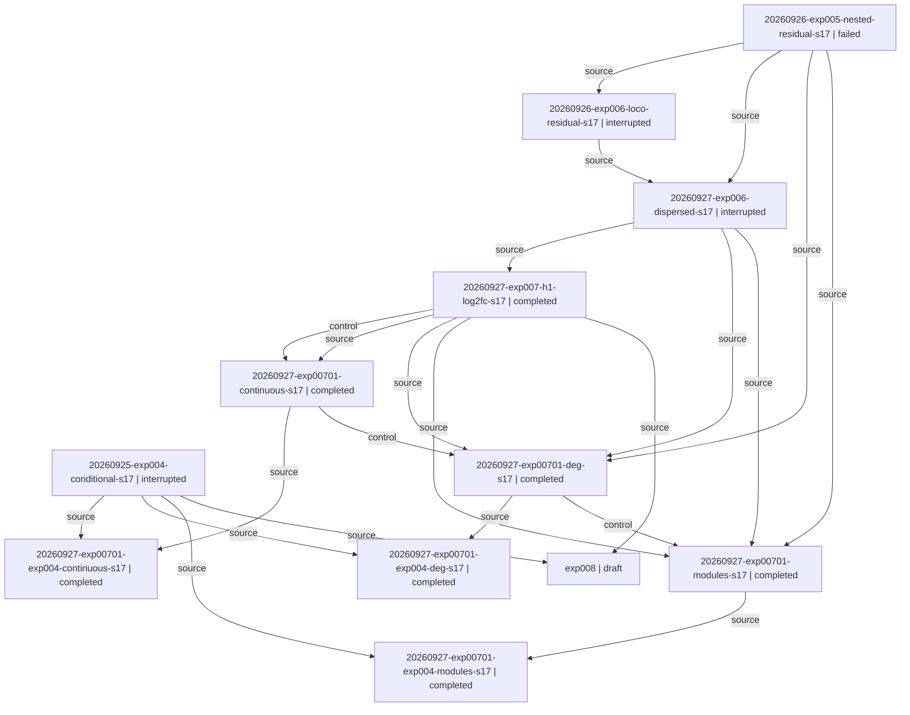

# Experiment DAG

Generated from the Git registry. Edges distinguish controls and reused sources.

```mermaid
flowchart TD
  n0["20260925-exp004-conditional-s17 | interrupted"]
  n1["20260926-exp005-nested-residual-s17 | failed"]
  n2["20260926-exp006-loco-residual-s17 | interrupted"]
  n3["20260927-exp006-dispersed-s17 | interrupted"]
  n4["20260927-exp007-h1-log2fc-s17 | completed"]
  n5["20260927-exp00701-continuous-s17 | completed"]
  n6["20260927-exp00701-exp004-continuous-s17 | completed"]
  n7["20260927-exp00701-deg-s17 | completed"]
  n8["20260927-exp00701-exp004-deg-s17 | completed"]
  n9["20260927-exp00701-modules-s17 | completed"]
  n10["20260927-exp00701-exp004-modules-s17 | completed"]
  n11["exp008 | draft"]
  n1 -->|source| n2
  n1 -->|source| n3
  n2 -->|source| n3
  n3 -->|source| n4
  n4 -->|control| n5
  n4 -->|source| n5
  n5 -->|source| n6
  n0 -->|source| n6
  n5 -->|control| n7
  n4 -->|source| n7
  n3 -->|source| n7
  n1 -->|source| n7
  n7 -->|source| n8
  n0 -->|source| n8
  n7 -->|control| n9
  n4 -->|source| n9
  n3 -->|source| n9
  n1 -->|source| n9
  n9 -->|source| n10
  n0 -->|source| n10
  n4 -->|source| n11
  n0 -->|source| n11
```
