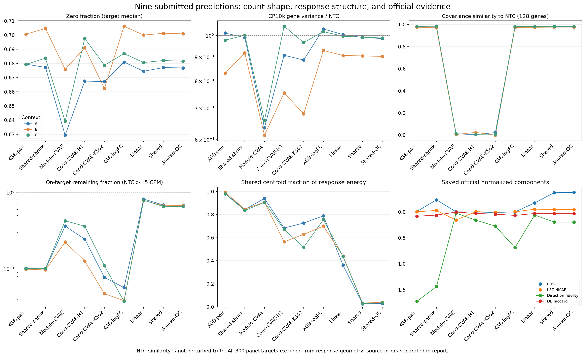

# 已提交 leaderboard 预测：counts 分布与模型能力

2026-09-30；comparison `C-LEADERBOARD-COUNTS-AUDIT`，evidence `E-LEADERBOARD-COUNTS-AUDIT`。

**结论：九份提交都产生了合法的单细胞计数，但没有哪一份获得“准确恢复扰动后完整分布”的证据。当前最好 Shared/QC 的可确认优势是部分已见靶点平均下游响应的跨背景迁移；细胞形态主要继承 NTC。效应幅度、DE 基因选择、未见扰动响应和扰动特异联合分布仍是主要短板。** 这不是“所有模型只会输出同一个均值”：新 Shared 的不同靶点确有不同响应，官方 PDS 也明显高于无信息水平。

## 范围、预定指标与证据入口

先读 [KnowGraph 指标依据及冻结源码核查](leaderboard_prediction_metric_foundations.md)，再按 [执行 PLAN](leaderboard_prediction_counts_PLAN.md) 固定计算口径并运行。Method Space 沿用已有方法；DAG 在两个已完成当前 run 上追加只读诊断阶段，另外六份历史提交作为明确的回顾来源，未反填初始化方法有效性。

全量扫描 **9份提交 × 3背景 × 300靶点 × 400细胞 = 3,240,000细胞**，每行18,533基因；共8,100个预测群体。另读取A/B/C各18,400个真实公开NTC，逐背景执行30次两个不交叉400细胞子集的抽样参照。九份提交包括同一checkpoint的不同输出臂和不同fold checkpoint，不是九次独立研究；27个模型×背景组合也不是27个独立生物背景。

所有h5ad与VCC档案重新计算SHA-256并匹配原生成/打包记录。回执均为 `val / vcc2026-val-1 / vcc2026-valA-r4+vcc2026-valB-r4+vcc2026-valC-r4`。本轮没有重新训练、生成预测或提交评分；官方六项是原published回执值，不是新跑出的隐藏真值分数。相同panel/anchor标签不认证线上构建配方，仍遵守 [r4证据边界](r4_anchor_audit.md)。

- [27组逐背景完整统计](leaderboard_prediction_counts_contexts.csv)：包括文库分位数、Fano、方差比、协方差、敲低覆盖与比例。
- [完整官方raw/normalized与entry身份](leaderboard_prediction_counts_scores.csv)、[响应几何及seen/unseen分层](leaderboard_prediction_counts_geometry.csv)、[全部输入哈希](leaderboard_prediction_counts_provenance.csv)。
- [执行产物入口](../../experiments/init-linear/outputs/init-linear-s01/cache/counts-audit-20260930/results.json)：链接原run下的9份逐靶CSV、矩统计NPZ与summary，原结果保持原身份。
- [分析工具](../../scripts/analyze_submitted_counts.py)；[同n的NTC抽样统计](../../experiments/init-linear/outputs/init-linear-s01/cache/counts-audit-20260930/ntc-resampling.csv)。

实际执行口径以PLAN为准：CP10k方差比使用NTC均值≥0.1 CP10k且方差>1e-8的基因；协方差使用每背景NTC最高log方差的128基因，并排除全部300靶基因。敲低只在NTC≥5 CPM的靶点计入主要比例。响应几何分别计算平均log1p(CP10k)差和算术CP10k均值的log2FC（1 CPM伪计数），均排除全部300靶基因；它们是辅助诊断，不冒充官方bulk-lognorm或DE口径。

依据文档还列出了可扩展指标。本轮未新增官方DE表、零响应模型重生成、Poisson/NB拟合或重复生成实验；因此不报告由这些流程才能得到的伪DE率、隐藏真值逐靶召回或生成器iid认证。独立NTC抽样只提供经验变异范围，不增加生物重复。

## 1. 计数合法，但分布结构差别很大

九份均满足完整基因顺序、A/B/C及每靶400细胞要求；**负数、非有限、小数、空细胞和超限文库均为0**。实际文库全范围703–58,580 counts；每档案存储元素为20.59–23.47亿，低于47.5亿上限。没有把log表达或归一化小数伪装成counts。

真实NTC的A/B/C文库中位数为20,109 / 19,946 / 20,034，零比例67.77% / 70.22% / 68.27%，平均检出5,973 / 5,519 / 5,881基因。文库CV分别0.459 / 0.385 / 0.438。基因raw Fano中位数分别1.497 / 1.321 / 1.404（均值≥0.1 count）。这些是本面板参照，不是要求所有扰动必须不变。

下表每格为A/B/C各背景统计的最小–最大值；文库、零率、方差比和协方差先对该背景300靶点取中位数。靶点残留比只用可估计目标。共享能量为平均log表达响应的centroid能量占比，并非counts中“多少来自NTC”。

| 模型 | 文库中位数 | 零比例% | CP方差比 | 协方差相关 | 靶点残留比 | 共享能量% |
| --- | --- | --- | --- | --- | --- | --- |
| XGB-pair | 19942–20645 | 67.9–70.1 | 0.83–1.01 | 0.976–0.984 | 0.10–0.10 | 98.0–99.2 |
| Shared-shrink | 20212–20674 | 67.7–70.5 | 0.92–1.00 | 0.970–0.984 | 0.10–0.10 | 83.6–84.7 |
| Module-CVAE | 22215–25162 | 62.9–67.6 | 0.61–0.66 | 0.005–0.012 | 0.22–0.43 | 90.7–93.9 |
| Cond-CVAE-H1 | 16079–19528 | 66.8–69.8 | 0.75–1.05 | 0.004–0.024 | 0.13–0.36 | 56.4–68.3 |
| Cond-CVAE-K562 | 18882–24977 | 66.2–67.9 | 0.68–0.97 | -0.002–0.023 | 0.05–0.11 | 51.7–72.7 |
| XGB-logFC | 19952–20118 | 68.1–70.6 | 0.93–1.03 | 0.973–0.981 | 0.04–0.06 | 70.0–78.9 |
| Linear | 19919–20142 | 67.5–70.0 | 0.91–1.00 | 0.975–0.982 | 0.79–0.82 | 36.2–44.0 |
| Shared | 19930–20147 | 67.7–70.1 | 0.90–0.99 | 0.976–0.983 | 0.65–0.68 | 2.6–3.3 |
| Shared-QC | 19925–20142 | 67.7–70.1 | 0.90–0.99 | 0.976–0.983 | 0.65–0.68 | 3.0–3.9 |

**模板型输出保留了NTC的主要统计形态，但这主要是继承能力。** XGB、旧shared、新linear/shared/QC都以NTC细胞为模板并保持其文库尺度；128基因协方差相关约0.970–0.984，与同n真实NTC的0.967–0.987范围重叠。单看这种相关性、零率或绝对表达相关，会高估模型的学习能力。例如旧XGB绝对表达与NTC相关达到0.9993以上，官方PDS仍只有0.5036。

同n参照尤其重要：400细胞相对全体NTC的CP方差比中位数，在A/B/C分别为0.990 / 0.900 / 0.992。因此新Shared/QC在B约0.90不能直接判为方差坍塌。Fano<1也不是硬违规；固定文库与组成约束会改变均值–方差关系。

**三份CVAE没有坍塌成相同细胞，却严重削弱了所检查的联合结构。** 它们的组内完全重复行率为0，逐基因CP方差比为0.61–1.05，说明仍有边际随机性；但是128基因协方差相关仅−0.002至0.024。同样400细胞的真实NTC约0.98，因此此现象不能仅由n=400解释。它们的文库CV约0.108–0.389，均低于相应NTC，Module-CVAE还产生更高文库和更多检出基因。

这提示当前VAE生成的细胞间依赖结构不可靠，不能由“边际方差不为0”宣布异质性已学好。但NTC不是隐藏扰动真值，不能要求扰动后协方差原样不变，也不能从此量直接断言所有真实扰动联合分布都预测错。该担忧与官方响应误差/PDS弱项相互印证；具体归因到latent、NB或未监督读出，仍需匹配干预。

重复行仅出现在新Shared/QC的未见靶点NTC重采样中，逐组最大2.5%；这些来自有放回抽样，不是均值复制型模式坍塌。

## 2. 敲低、靶点特异性和未见扰动是三种不同能力

**敲低符合方向不等于学到了下游效应。** 旧XGB-pair与Shared-shrink的约10%靶点残留来自源码强制乘数0.1，不能计为学习成果。XGB-logFC没有此强制规则，确实预测出约4%–6%的靶点残留，但其PDS为0.49968、Jaccard为0.00552；它学到了通用自身抑制模式，却没有有效恢复下游扰动身份。

新Linear预测靶点残留79%–82%，Shared/QC为65%–68%，抑制幅度较保守。Shared-QC在A/B/C可估计目标为299/295/293个，下降比例88.0%/89.8%/87.4%，残留≤50%的比例28.4%/32.5%/32.1%。这些是包括未见靶点的任务比例；剩余1/5/7个低表达靶点单列，不强判敲低失败。真实逐靶敲低效率隐藏，不能把统一90%敲低设为硬性合格线。

**旧模型的共同偏移与新Shared的靶点差异不可混淆。** 去掉全部300靶基因后，旧XGB的共享能量达98.0%–99.2%，Module-CVAE为90.7%–93.9%；前者全部靶点复用同一批400 NTC模板，固定模板袋的抽样偏移也会被计入共同分量。新Shared/QC只有2.6%–3.9%，说明不同靶点并非都输出同一共同响应。新Linear则为36.2%–44.0%，当前拟合包包含更强的系统性分量。

低共享能量和高有效秩本身并不证明学对：Shared未见28靶的去共享有效秩仍约25.3–25.5，接近可达到的27，但这些变化实际只是NTC抽样噪声。判断正确性必须看真实标签分数，不能奖励“输出彼此不同”。

**当前最好模型的未见扰动能力明确缺失。** 对Shared和Shared-QC的28个未见靶点，全部33,600预测细胞/提交都与输入NTC中某一行完全相同。其响应RMS中位数A/B/C为0.01320/0.01287/0.01296，处于400细胞NTC对全池的抽样范围（约0.0122–0.0142）。这是源码零Δ分支的实测验证，不是泛化预测。Linear在未见靶点上有非零背景项，但没有该靶点的训练效应；本轮没有未见子集的官方分数，不能据非零输出宣布泛化成功。

**直接响应监督范围比“五背景训练”更窄。** 本轮额外读取原冻结训练统计的labels/positions，确认当前Shared使用的官方272个已见靶点全部仅在K562有标签，RPE1/HepG2/Jurkat为0；K562实测官方读出为7,680/18,533。故该臂对官方靶点实际上是在迁移K562平均响应，其他10,853个读出没有这些靶点的直接响应监督，Shared的相应Δ为零。不同来源的测量并集覆盖不能冒充每个靶点的监督覆盖。[带哈希的监督覆盖核对](../../experiments/init-linear/outputs/init-linear-s01/cache/counts-audit-20260930/supervision-coverage.json)

零Δ不表示最终counts逐基因不变：其余基因的变化和共同文库归一化仍可改变这些基因的输出。这也不能解释为模型学到了这些未监督坐标的响应。

## 3. 官方六项说明学到的是有限的区分能力，幅度和DE仍弱

下表原始项来自原回执。PDS/Fidelity/Reach/Jaccard越高越好，MSE/NMAE越低越好；Overall是官方归一化六项平均，不是raw项平均。官方没有在这些回执中返回逐背景/逐靶有效数，不能补造900个有效评分单元。

| 模型 | PDS | MSE | LFC NMAE | Fidelity | Reach | Jaccard | Overall |
| --- | --- | --- | --- | --- | --- | --- | --- |
| XGB-pair | 0.50364 | 2.09337 | 0.99983 | 0.00077 | 0.05891 | 4.806e-06 | -0.30315 |
| Shared-shrink | 0.60588 | 1.97335 | 0.98325 | 0.08589 | 0.12520 | 0.00790 | -0.19784 |
| Module-CVAE | 0.50105 | 11.96658 | 1.10027 | 0.50595 | 0.04920 | 0.02954 | -0.03590 |
| Cond-CVAE-H1 | 0.49938 | 3.76259 | 0.99780 | 0.46690 | 0.07515 | 0.01963 | -0.03113 |
| Cond-CVAE-K562 | 0.49529 | 3.12643 | 1.00567 | 0.43136 | 0.07213 | 0.01493 | -0.05696 |
| XGB-logFC | 0.49968 | 1.47530 | 1.00019 | 0.30974 | 0.06740 | 0.00552 | -0.12780 |
| Linear | 0.58007 | 4.09619 | 0.96688 | 0.49458 | 0.13918 | 0.01938 | 0.03380 |
| Shared | 0.66906 | 4.53190 | 0.97095 | 0.45485 | 0.16887 | 0.01905 | 0.04897 |
| Shared-QC | 0.67137 | 4.72351 | 0.97075 | 0.45416 | 0.17227 | 0.01892 | 0.05008 |

对应normalized分项（均越高越好）：

| 模型 | PDS | MSE | LFC NMAE | Fidelity | Reach | Jaccard | Overall |
| --- | --- | --- | --- | --- | --- | --- | --- |
| XGB-pair | 0.00759 | 0.00000 | 0.00182 | -1.72295 | -0.02281 | -0.08256 | -0.30315 |
| Shared-shrink | 0.23232 | 0.00000 | 0.02930 | -1.43903 | 0.05204 | -0.06165 | -0.19784 |
| Module-CVAE | 0.00214 | 0.00000 | -0.15685 | -0.02446 | -0.03383 | -0.00241 | -0.03590 |
| Cond-CVAE-H1 | -0.00149 | 0.00000 | 0.00557 | -0.15754 | -0.00402 | -0.02930 | -0.03113 |
| Cond-CVAE-K562 | -0.01046 | 0.00000 | -0.00687 | -0.27397 | -0.00773 | -0.04275 | -0.05696 |
| XGB-logFC | 4.986e-05 | 0.00000 | 0.00089 | -0.68675 | -0.01323 | -0.06774 | -0.12780 |
| Linear | 0.17377 | 0.00000 | 0.05272 | -0.06120 | 0.06763 | -0.03010 | 0.03380 |
| Shared | 0.37124 | 0.00000 | 0.04647 | -0.19450 | 0.10155 | -0.03091 | 0.04897 |
| Shared-QC | 0.37633 | 0.00000 | 0.04684 | -0.19687 | 0.10543 | -0.03125 | 0.05008 |

按[冻结官方指标定义](https://github.com/ArcInstitute/cell-eval2/blob/5e64833518a6603a0301cbe28185d49c30f4a986/docs/vcc2026_metrics/vcc2026-metrics-brief.md)，PDS是正确扰动匹配的相对名次，无信息为0.5，**不是分类准确率**。MSE raw是相对真实扰动变化尺度的去噪误差，控制复制的期望无信息值约1；NMAE对真实DE的LFC衡量误差，零LFC预测对应1。不能把MSE normalized=0解释为误差为零，也不能把Fidelity复合指标当作简单方向正确率。

- Shared/QC的PDS约0.669/0.671，明显高于0.5，且PDS排除了全部靶基因。这支持它们迁移了部分下游扰动特异信号，不能仅由自身敲低解释。
- **九份提交的MSE raw全部高于1（1.475–11.967），normalized全部触底为0。** 当前最好QC raw为4.724；其平均表达误差相对真实扰动信号仍然很大。
- QC的LFC NMAE为0.97075，仍接近零LFC基准；Jaccard只有0.01892。其方向Fidelity和Jaccard normalized为−0.19687/−0.03125，说明在回执标尺上仍弱于对应baseline。它并未准确恢复效应幅度、显著基因集合与方向/发现量平衡。
- QC的PDS normalized=0.37633，单项对Overall贡献约+0.06272，超过最终Overall +0.05008；方向Reach和NMAE虽有正贡献，Fidelity/Jaccard负项抵消了部分收益。不能用略正的Overall概括为整体生物学保真。

同次配对导出的Shared相对Linear，Overall提高0.015170、PDS raw提高0.088982，但MSE raw恶化0.435708、NMAE恶化0.004068；这是不同能力的取舍。两者还存在正则与参数化差异，不能把此差异单独归因于“背景信息有害”。QC相对Shared仅增加Overall 0.001104、PDS raw 0.002319，同时MSE raw恶化0.191613；无重复生成和逐背景回执，不作稳定提升主张。历史模型间变化更多，只作描述性整包比较。

## 4. 能力结论与下一步

| 能力 | 本轮判断 | 证据与边界 |
|---|---|---|
| 合法counts、面板与细胞数 | 已具备 | 九份全量检查通过；这只是输出契约 |
| 背景表达、深度、稀疏度与部分共变结构 | 模板型输出保留良好，主要来自NTC继承 | 固定文库/NTC模板不是训练出的扰动后RNA量变化 |
| 已见靶点平均下游响应迁移 | Shared/QC有有限能力 | 非同一centroid、PDS>0.5；主要是K562目标响应迁移 |
| 自身靶点抑制 | 有通用规则/有限学习，不能替代下游能力 | 两个旧模型硬编码；XGB-logFC强抑制仍无PDS；新Shared偏保守 |
| 真实效应幅度、DE基因与方向/发现量 | 弱 | MSE全部触底；最佳模型NMAE近1、Jaccard约0.019、Fidelity低于baseline |
| 全局未见扰动 | Shared/QC未实现；其他路线未得到支持 | 28靶完全回退NTC；非零外推不等于正确 |
| 背景特异的响应修正 | 尚无本轮可归因的稳定收益 | 现有Linear整包未超过Shared的总体表现，不足以否定条件化机制本身 |
| 扰动特异的细胞异质性与联合分布 | 尚未验证；现有CVAE出现强风险信号 | 模板型无可学习分布头；CVAE所检协方差丢失，且官方下游指标弱 |

最值得保留的是“目标NTC + 有监督的同靶平均响应”这一实际有效部分。下一步维持当前Ledger的三个研究问题，不用继续微调文库/零率替代响应建模：

1. `C-POPULATION-EMISSION`：把效应估计与细胞发射分开；检验零响应、非零期望、同n抽样波动及联合结构。当前诊断不证明新的生成器有效。
2. `C-LOCAL-EVAL-SUPPORT`：在有真实扰动的五背景完整有效面板上，同时报告六项、seen/joint OOD、去模板及n敏感性；不要以少背景或细胞数放大生物独立性。
3. `C-DEPMAP-RESPONSE-ALIGNMENT`：把建模预算用于有真值检验的响应对齐、未见靶点和未测读出外推，比较无先验/匹配随机；不能只让预测“更多样”或“更像NTC”。

KnowGraph复盘：WL-UMI硬约束已检查；WL-DEPTH/ST-COUNT-MODELS提示需要同n参照，得到实际支持；WL-KD-EFFICIENCY提示的“自身敲低≠下游正确”被多份提交具体呈现；EVAL-MODE-COLLAPSE/EVAL-SYSVAR帮助区分共同偏移、噪声秩和真实标签区分度；EVAL-BIO-FIDELITY提醒了边际计数与联合结构的区别。本轮没有验证图谱中任何新架构、NTC到模板映射或DepMap先验有效。

所有A/B/C回执及本轮诊断均为开发证据。缺少隐藏扰动矩阵、逐背景官方明细、独立生成重复及新增生物背景，不能认证完整扰动后分布、精确因果机制或SOTA。NTC偏离从未直接计为错误；本轮未将预测vsNTC差异命名为伪DE。
